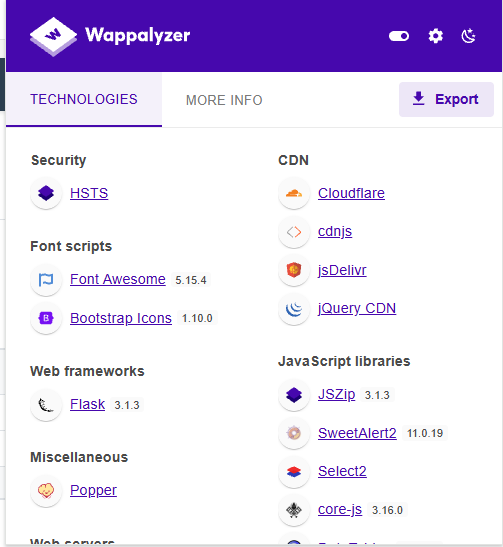
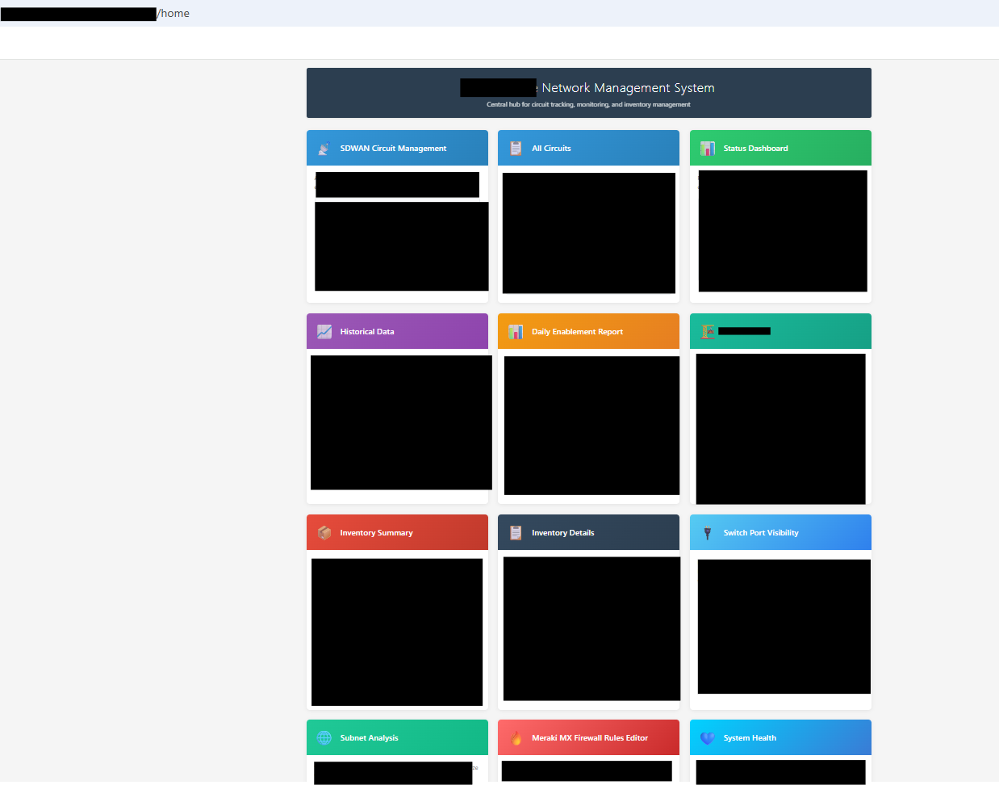
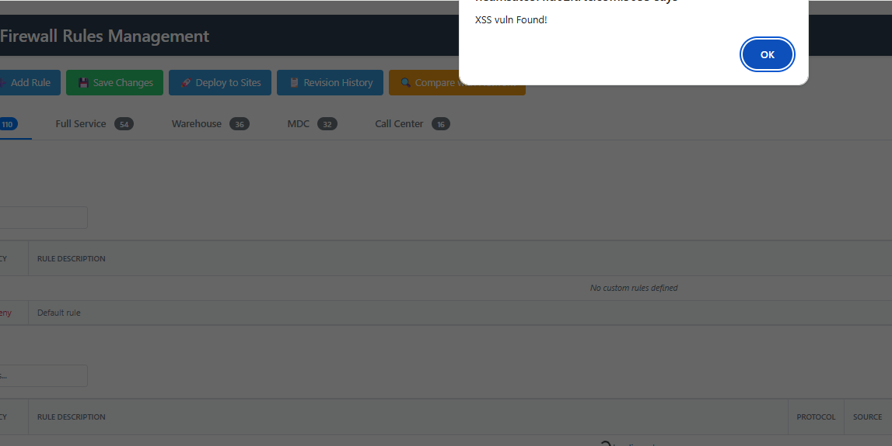
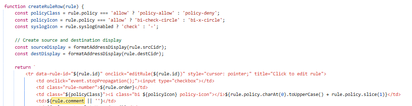

# 🛡️ Penetration Test Report: Stored & Reflected XSS in Rule Comment Field

# 🧪 Preface

This report documents a **manual gray-box mock Web Application test** conducted with **explicit permission** from the system owner. The target of the assessment was a **network management system application** developed using **ClaudeAI**, utilizing both **JavaScript** on the frontend and **Flask/Python** on the backend.

The system integrates with multiple **network infrastructure APIs**, such as **Meraki Cloud**, and aggregates this data into dashboards designed for **Network Operations Centers (NOC)**.

> ⚠️ **Disclaimer:** This test was performed on a **development environment** solely for **educational and learning purposes**. No production data or infrastructure was affected. This report should not be misinterpreted as an indication of vulnerabilities in any live or commercial system.

---

## 📍 Affected Endpoint
- **POST** `/api/firewall/template/<location>`

## 🧪 Vulnerability Type
- Stored (Persistent) XSS
- Reflected XSS
- HTML Injection

## 📝 Summary

The application accepts and stores unsanitized user input in the **comment field** of the Meraki rule editor. The payload is both:

- **Reflected immediately** in the HTTP response (Reflected XSS)
- **Persisted** and displayed to future users (Stored XSS)

Additionally, basic HTML tags such as `<a>` are rendered unsanitized, enabling phishing attacks through malicious links.

---

## 🔍 Enumeration


| Technologies Identified |            
|-------------------------|       
|**Frontend**: JavaScript   |    
|**Backend**: Flask (Python) |   
| **APIs Consumed**: Meraki Cloud|

| Tools Used |
|-----------------------|
| Burp Suite Community |
| Wappalyzer  |
| Browser DevTools|


>*Browsing the system homepage we can see the nms(network management system ) has multple tiles that display information from diffrent network systems. Using wappalyzer it was deduced that the system is running a few javascript libraries and flask web framework.*
  




>*Focusing on the site paths that allowed user input I landed on the meraki firewall tile or /firewall path of the system*





---

## 🔬 Technical Detail
### 1. Reflected XSS

- Payload: `<script>alert(1)</script>`
- Behavior: Reflected directly in HTTP response upon form submission.


>*In the firewall page user is allowed to edit meraki firewall rules from the system and notice the comment field takes user input.*

>*Intercepting the request in burpsuite reveals that editing the rule comment send a post to the `/api/firewall/template/{template}/update` api path ,here we can send our payload in the comment field with no encoding and a successful reponse is returned.*


---

### 2. Stored XSS (Persistent)

- The same payload, once saved, is displayed to all users when they view the comment.
- Increases risk by automatically impacting any user who views the malicious entry.



---

### 3. HTML Injection for External Links

- Payload: `<a href="https://evil.com">Click me</a>`
- Behavior: This link is rendered and clickable, allowing redirection to phishing sites or attacker-controlled domains.

---

## 🎯 Payload Execution Sequence

*An attacker submits a malicious payload to the comment field of the application. This payload is then stored in the backend database without proper sanitization. When the frontend retrieves and renders the comment, it does so using an unsafe template literal, injecting the raw content directly into the DOM when a rule is created or in this case updated. 
As a result, any user who views the rule table in the interface will unknowingly trigger the execution of the attacker’s payload in their browser*

 Example of Vulnerable Code:|
|-----------------------------|

```javascript
function createRuleRow(rule) {
    return `<td>${rule.comment || ''}</td>`; // 🚨 No sanitization
}
```

---

## 🔥 Impact

- Credential theft via phishing links
- Session hijacking through JavaScript execution
- CSRF or forced actions using stored scripts
- Redirects to attacker-controlled domains

---

## 🧪 Proof of Concept

### Stored XSS Payload:
```html
<script>alert('XSS Vulnerability')</script>
```

### HTML Injection Payload:
```html
<a href="https://evil.com" target="_blank">Click me</a>
```

---

## 🛠️ Recommendations & Remediation

### ✅ Input Validation

- Validate all user-supplied input on the server side.
- Disallow any unexpected or special characters in fields that should not accept HTML or JavaScript.
- Enforce strong schema validation (e.g., using JSON schema or backend validators).

---

### ✅ Output Encoding / Escaping

- Escape output **before inserting it into HTML**, not during input.
- Use libraries or helper functions to HTML-encode all user-generated content when rendered into the DOM.

**Example Escaping Function:**
```javascript
function escapeHtml(text) {
    return text
        .replace(/&/g, "&amp;")
        .replace(/</g, "&lt;")
        .replace(/>/g, "&gt;")
        .replace(/"/g, "&quot;")
        .replace(/'/g, "&#x27;");
}
```

**Corrected Rendering Example:**
```javascript
function createRuleRow(rule) {
    return `<td>${escapeHtml(rule.comment || '')}</td>`;
}
```

---

### ✅ Content Sanitization

If your application **needs to allow limited HTML**, do the following:

- Use a library like **DOMPurify** (client-side) or **Bleach** (Python) or **OWASP Java HTML Sanitizer** (Java).
- Strip or encode any script tags, inline event handlers (e.g., `onclick`), and untrusted attributes.
- Whitelist only safe tags and attributes.

**Recommended Allowed Tags:**
- `<b>`, `<i>`, `<u>`, `<strong>`, `<em>`, `<a href target rel>`

**Recommended Allowed Attributes:**
- `href`, `rel`, `target` (for links)
- Always add `rel="noopener noreferrer"` to `<a>` tags that open in a new tab.

---

### ✅ Security Headers

Set the following HTTP headers globally:

- **Content-Security-Policy (CSP)**  
  Example:
  ```
  Content-Security-Policy: default-src 'self'; script-src 'self'; object-src 'none'; base-uri 'none';
  ```

- **X-Content-Type-Options**  
  ```
  X-Content-Type-Options: nosniff
  ```

- **X-Frame-Options**  
  ```
  X-Frame-Options: DENY
  ```

- **HttpOnly and Secure Cookie Flags**  
  Set `HttpOnly`, `Secure`, and `SameSite=Strict` for all session cookies.

---

## 📈 CVSS Score Estimate

| Metric                 | Value      |
|------------------------|------------|
| Attack Vector          | Network    |
| Attack Complexity      | Low        |
| Privileges Required    | Low        |
| User Interaction       | Required   |
| Confidentiality Impact | High       |
| Integrity Impact       | High       |
| Availability Impact    | Low        |
| **Base Score (est.)**  | 8.2 - 9.0  |

> Use the CVSS Calculator: https://www.first.org/cvss/calculator/

---

## 🔚 Conclusion

The application reflects and stores raw user input in an HTML context without sanitization or escaping. This introduces both **reflected** and **stored XSS** vulnerabilities, which can be abused for credential theft, session hijacking, phishing, and script injection.

Although the affected system is internal, it should still be treated as critical due to the potential for chained attacks, lateral movement, and browser-based exploitation. Developers should apply robust input/output encoding and sanitization practices, implement proper CSP and HTTP security headers, and test remediation steps thoroughly in staging.

---